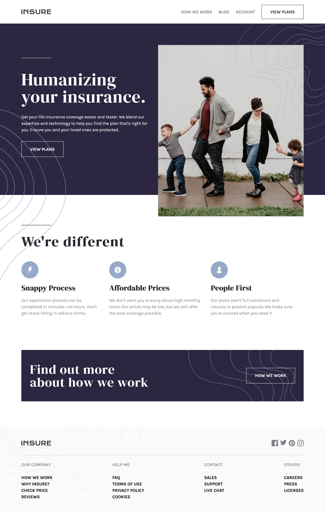

# Frontend Mentor - Insure landing page solution

This is a solution to the [Insure landing page challenge on Frontend Mentor](https://www.frontendmentor.io/challenges/insure-landing-page-uTU68JV8). Frontend Mentor challenges help you improve your coding skills by building realistic projects.

## Table of contents

- [Overview](#overview)
  - [The challenge](#the-challenge)
  - [Screenshot](#screenshot)
  - [Links](#links)
- [My process](#my-process)
  - [Built with](#built-with)
  - [What I learned](#what-i-learned)
  - [Continued development](#continued-development)
- [Author](#author)
- [Acknowledgments](#acknowledgments)

## Overview

### The challenge

Users should be able to:

- View the optimal layout for the site depending on their device's screen size
- See hover states for all interactive elements on the page

### Screenshot

### Links

- Solution URL: [Github](https://github.com/AdamElitzur/FM-Insure-landing-page#screenshot)
- Live Site URL: [Insure Landing Page](https://fm-insure-landing-page-delta.vercel.app/)

## My process

### Built with

- Semantic HTML5 markup
- Flexbox
- Mobile-first workflow
- JS and DOM manipulation

### What I learned

I have never collaborated on a programming project before this project, and I learned a lot about collaboration. I got better at using Git and the command line. I also improved my CSS and working with background images, which has been a challenge in the past.

### Continued development

I would love to keep collaborating as it's super exciting and fun to be working in a team.

## Author

-   Frontend Mentor - [@AdamElitzur](https://www.frontendmentor.io/profile/adamelitzur)
- Twitter - [@adamcandoit](https://twitter.com/adamcandoit)

## Acknowledgments

As I mentioned above, this was my first collaboration. I got to know [Tyrell Curry](https://tyrellcurry.io/) from the Frontend Mentor Slack channel, and we started collaborating on the Insure Landing Page challenge.
